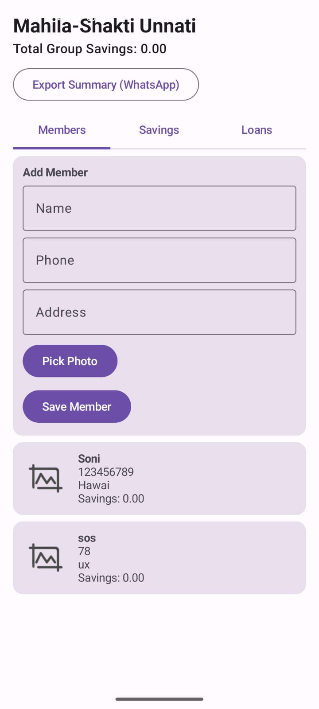
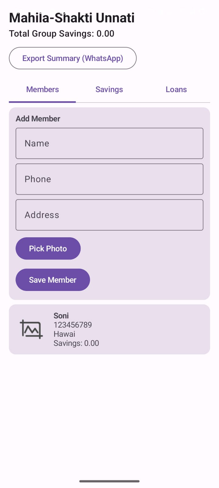
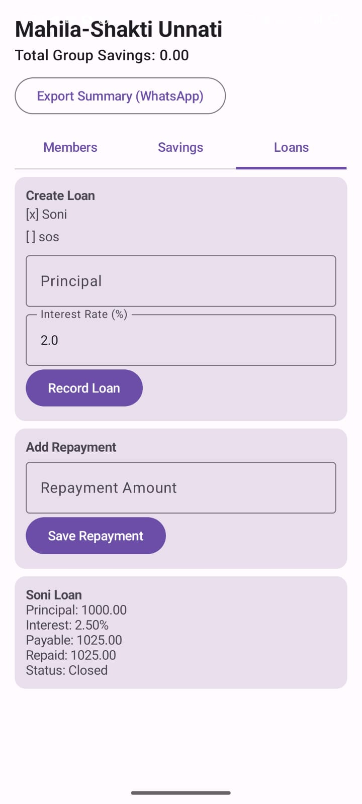

# Mahila-Shakti Unnati 🏦

A digital ledger Android application for women's Self-Help Groups (SHGs), designed to replace error-prone physical registers with a transparent, automated financial management system.

## 📋 Problem Statement

Self-Help Groups (SHGs) are a vital financial backbone for women in rural communities, but they rely on manual, physical registers to track savings and loans. Manual calculations are error-prone, leading to financial discrepancies and trust issues among group members. There is no accessible digital tool for these groups to transparently manage their pooled capital.

## 💡 Solution

Mahila-Shakti Unnati acts as a **"Digital Accountant"** that automates the entire SHG financial workflow:

- **Member Directory** — Add and manage members with photos and contact details.
- **Savings Tracker** — Log weekly contributions and mark them as Paid or Pending.
- **Loan Management** — Issue loans, track repayments, and auto-calculate simple interest.
- **Smart Validations** — Prevents duplicate unpaid loans, enforces 10-digit phone numbers, and blocks overpayments.
- **Export & Share** — Generate clean financial summaries and share them instantly via WhatsApp.

## 🛠️ Tech Stack

| Layer | Technology |
|---|---|
| **Language** | Kotlin |
| **UI** | Jetpack Compose with Material 3 |
| **Database** | Room (SQLite abstraction with migrations) |
| **Architecture** | MVVM (Model-View-ViewModel) |
| **Async** | Kotlin Coroutines & StateFlow |
| **Image Loading** | Coil |
| **CI/CD** | GitHub Actions + Gradle |

## 🏗️ Project Structure

```
app/src/main/java/com/shg/mahilashaktiunnati/
├── MainActivity.kt                  # Entry point
├── ShareUtil.kt                     # WhatsApp/Intent sharing
├── data/
│   ├── AppDatabase.kt               # Room database setup
│   ├── Entity.kt                    # Member, Savings, Loan, Repayment entities
│   ├── LegacyMigrations.kt          # Schema migration (v1 → v2)
│   ├── Relations.kt                 # One-to-many relationships
│   ├── ShgDao.kt                    # Data Access Object (queries)
│   └── ShgRepository.kt             # Repository pattern (business logic)
└── ui/
    ├── MahilaShaktiUnnatiApp.kt      # Composable UI screens
    ├── MahilaShaktiViewModel.kt      # ViewModel with input validation
    └── UiModels.kt                   # UI state data classes
```

## ✅ Success Criteria (All Met)

| Criteria | Status |
|---|---|
| Total savings update instantly when a new entry is added | ✅ Implemented via reactive `Flow` |
| App prevents a loan if the member has an existing unpaid loan | ✅ Enforced in `ShgRepository.createLoan()` |
| Data is exportable as a clean text string | ✅ Via `buildSummaryText()` + Intent sharing |
| Database migrations are handled correctly | ✅ `LegacyMigrations.kt` (v1 → v2) |

## 📱 Screenshots

<p align="center">
  
  
  
</p>

## 🚀 How to Build

### Option 1: GitHub Actions (Recommended)
1. Push to `master` branch.
2. Go to the **Actions** tab on GitHub.
3. Download the `app-debug.apk` artifact from the latest successful run.
4. Install the APK on your Android phone.

### Option 2: Local Build
```bash
# Requires JDK 17 and Android SDK
./gradlew assembleDebug
# APK will be at app/build/outputs/apk/debug/app-debug.apk
```

## 📝 Input Validations

- **Phone Number**: Must be exactly 10 digits (regex enforced).
- **Name & Address**: Cannot be blank.
- **Savings/Loan Amounts**: Must be positive numbers.
- **Repayment Amount**: Cannot exceed the remaining loan balance.
- **Duplicate Loans**: A member cannot have more than one open loan at a time.

## 👩‍💻 Author

Sahil Srivastava
